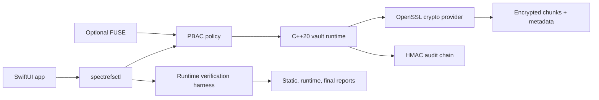

## Problem

Desktop encryption products have a hard usability gap: strong at-rest encryption often breaks normal file workflows, while convenient workflows can obscure when plaintext exists and who can touch it. I wanted SpectreFS to model a more honest product boundary: client-side authenticated encryption for vault storage, app-mediated workflows for plaintext use, and reports that prove which claims actually execute.

The key design constraint was not to pretend this is production endpoint containment. Other apps can see encrypted vault files on disk. Plaintext access is mediated through SpectreFS workflows, and temporary plaintext exposure is documented as a limitation until stronger OS-level containment such as Endpoint Security or a system extension exists.

## Architecture

SpectreFS is split around a security boundary that is easy to inspect:

```text
SwiftUI app -> spectrefsctl -> vault runtime -> crypto provider -> encrypted chunks
```

- The C++20 core owns vault format, encrypted metadata, chunk IO, manifest authentication, repair, snapshots, quarantine, audit, policy, and optional FUSE integration.
- The OpenSSL-backed crypto provider implements scrypt/PBKDF2 compatibility, wrapped random vault master keys, HKDF domain-separated subkeys, AES-256-GCM chunks, HMAC-SHA256, and CSPRNG-backed nonces.
- `spectrefsctl` is the operational surface for create, put, get, list, auth, lock, policy, protected open, health, repair, snapshot, audit verify, crypto verify, manifest verify, and share/export demos.
- The SwiftUI app calls the existing CLI and parses JSON output instead of reimplementing crypto in Swift.
- PBAC, HMAC audit chaining, no-FUSE protected open, optional FUSE mode, recovery, and release gates stay explicit instead of being hidden behind UI copy.



## Proof

The strongest part of the project is that the security story is executable. The full demo builds or discovers `spectrefsctl`, creates a temporary vault, writes a harmless secret marker, imports it, exports it, compares hashes, scans for plaintext leakage, tries the wrong password, tampers with encrypted data, verifies audit integrity, and emits both JSON and Markdown reports.

```sh
./demo/full_security_demo.sh
```

Current verification snapshot:

```text
PASS=115
FAIL=0
PARTIAL=0
MISSING=0
PLANNED=2
```

The generated evidence lives in:

- `build/security_feature_audit.json`
- `build/security_runtime_report.json`
- `build/security_final_report.json`
- `docs/IMPLEMENTATION_STATUS.md`
- `docs/SECURITY_VERIFICATION_REPORT.md`

Focused demos cover tamper detection, auth/lock behavior, E2EE share capsules, and memory-safety hardening:

```sh
./demo/tamper_detection_demo.sh
./demo/auth_demo.sh
./demo/e2ee_share_demo.sh
./demo/memory_safety_demo.sh
```

## Security Model

What SpectreFS currently protects:

- File contents are stored as authenticated encrypted chunks.
- Filenames and logical paths are represented through encrypted metadata instead of plaintext vault filenames.
- Manifests are authenticated.
- Audit events are HMAC chained.
- Wrong passwords fail cleanly.
- Tampered vault content is detected by verification or decrypt paths.
- Protected-open workflows use restricted temporary workspaces, cleanup, quarantine-on-failure, and audited PBAC decisions.

What it does not claim:

- No production-grade endpoint containment.
- No guarantee that other apps can never observe plaintext while a file is materialized.
- No resistance to root, admin, kernel, malicious allowed apps, rollback without trusted external state, or SSD/APFS secure deletion limits.
- No external crypto audit yet.
- E2EE applies to share/export capsules only.

The two remaining planned-only items are intentional: a signed `SpectreFSCore.xpc` helper boundary for moving sensitive workflows out of the app process, and optional sender signatures for E2EE capsules so recipients can verify who created an export.

## Result

SpectreFS is a portfolio-grade security product prototype with measurable runtime evidence. It shows C++ systems work, macOS app design, cryptographic API discipline, untrusted data handling, auditability, release engineering, and honest threat modeling in one project.

That honesty is the point: the project demonstrates client-side authenticated encryption and app-mediated plaintext workflows today, while clearly separating future hardening such as XPC isolation, Endpoint Security containment, external crypto review, and stronger production distribution evidence.
