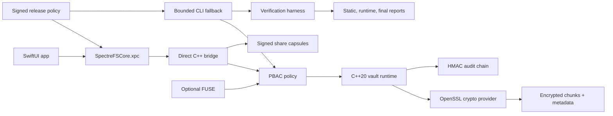

## Problem

Desktop encryption products have a hard usability gap: strong at-rest encryption often breaks normal file workflows, while convenient workflows can obscure when plaintext exists and who can touch it. I wanted SpectreFS to model a more honest product boundary: client-side authenticated encryption for vault storage, app-mediated workflows for plaintext use, and reports that prove which claims actually execute.

The key design constraint was not to pretend this is production endpoint containment. Other apps can see encrypted vault files on disk. Plaintext access is mediated through SpectreFS workflows, and temporary plaintext exposure is documented as a limitation until stronger OS-level containment such as Endpoint Security or a system extension exists.

## Architecture

SpectreFS is split around a security boundary that is easy to inspect:

```text
SwiftUI app -> SpectreFSCore.xpc -> C++ bridge -> vault runtime -> crypto provider -> encrypted chunks
```

- The C++20 core owns vault format, encrypted metadata, chunk IO, manifest authentication, repair, snapshots, quarantine, audit, policy, and optional FUSE integration.
- The OpenSSL-backed crypto provider implements scrypt/PBKDF2 compatibility, wrapped random vault master keys, HKDF domain-separated subkeys, AES-256-GCM chunks, HMAC-SHA256, and CSPRNG-backed nonces.
- The SwiftUI app prefers a bundled XPC service that validates requests and routes session-bearing operations through a direct C++ bridge.
- Signed release policy denies unsigned code and unsafe helper or CLI fallback in release builds.
- `spectrefsctl` remains the operator surface and a bounded development fallback for compatible commands.
- Share capsules support Ed25519 sender signatures, local trust records, expiration checks, and replay tracking.
- PBAC, HMAC audit chaining, no-FUSE protected open, optional FUSE mode, recovery, and release gates stay explicit instead of being hidden behind UI copy.



## Proof

The project keeps implementation evidence, runtime evidence, and production readiness separate. The current static audit reports:

```text
IMPLEMENTED=105
MISSING=0
PARTIAL=0
FAIL=0
```

The retained full runtime snapshot still reports `PASS=115` and `FAIL=0`, but it predates the v0.3 XPC and sender-signature hardening. It must be regenerated before those counts are used as current v0.3 release evidence.

The generated evidence surfaces include:

- `build/security_feature_audit.json`
- `build/security_runtime_report.json`
- `build/security_final_report.json`
- `docs/IMPLEMENTATION_STATUS.md`
- `docs/SECURITY_VERIFICATION_REPORT.md`

Focused workflows cover tamper detection, auth and lock behavior, signed E2EE share capsules, memory-safety hardening, release policy, XPC parity, package verification, and benchmark regression:

```sh
./demo/tamper_detection_demo.sh
./demo/auth_demo.sh
./demo/e2ee_share_demo.sh
./demo/memory_safety_demo.sh
bash scripts/release_gate.sh
```

## Security Model

What SpectreFS currently protects:

- File contents are stored as authenticated encrypted chunks.
- Filenames and logical paths are represented through encrypted metadata instead of plaintext vault filenames.
- Manifests are authenticated.
- Audit events are HMAC chained.
- Wrong passwords fail cleanly.
- Tampered vault content is detected by verification or decrypt paths.
- Protected-open workflows use restricted temporary workspaces, cleanup, quarantine-on-failure, and audited PBAC decisions.
- The app prefers an XPC boundary with request validation and a direct C++ bridge.
- Share capsules can be signed, checked against local sender trust, expired, and rejected on replay.

What it does not claim:

- No production-grade endpoint containment.
- No guarantee that other apps can never observe plaintext while a file is materialized.
- No resistance to root, admin, kernel, malicious allowed apps, rollback without trusted external state, or SSD/APFS secure deletion limits.
- No external crypto audit yet.
- E2EE and sender signatures apply to share/export capsules only.
- The retained runtime snapshot does not prove all v0.3 hardening until the release gate is regenerated.

## Result

SpectreFS is a hardened technical-preview security product with inspectable implementation evidence. It shows C++ systems work, macOS XPC design, cryptographic API discipline, untrusted data handling, auditability, release engineering, and honest threat modeling in one project.

That honesty is the point: XPC isolation and signed capsule hardening now exist, while Endpoint Security containment, external crypto review, fresh v0.3 runtime evidence, and production distribution proof remain explicit blockers.
